# Mail

## Sommaire

- [Gmail](#gmail) 
- [Thunderbird](#thunderbird)
- [Annexe](#annexe)

### Interface Web

https://roundcube.telecomnancy.eu/ \
https://webmail.telecomnancy.eu/SOGo/so/

LoginUL \
MotDePasseDeL'UL

### Connecter sa .eu à Gmail ou Thunderbird

## Gmail

#### Mobile (Android / IOS)

Ouvrez l'application Gmail.

En haut à droite, appuyez sur votre photo de profil

Cliquez sur Ajouter un autre compte.

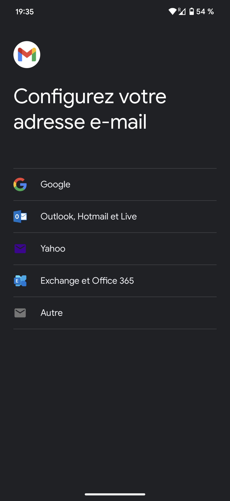

Cliquez sur Autre

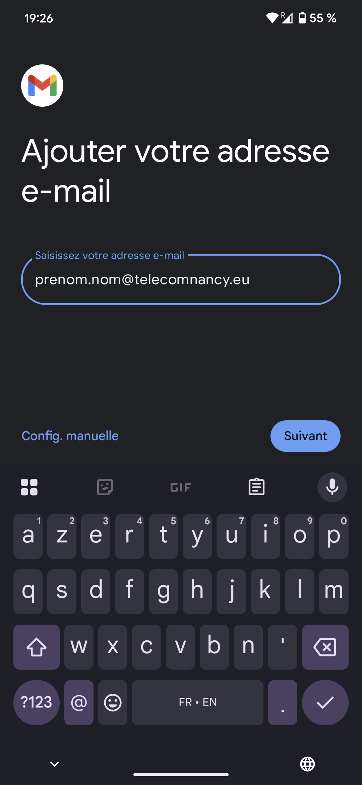

Remplacez prenom et nom par votre Prenom et votre Nom

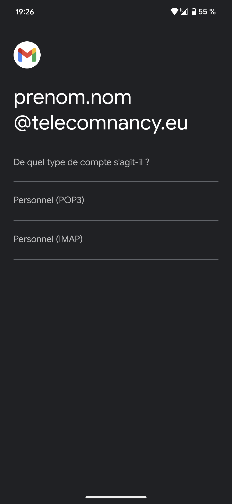

Cliquez Sur Personnel (IMAP)

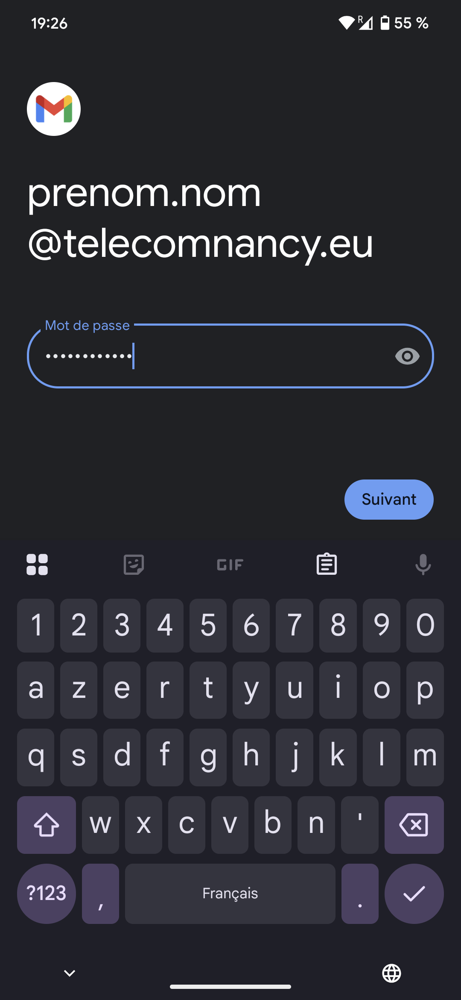

Mettez votre mots de passe de L'UL

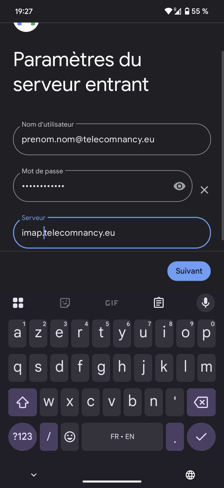

Il faut changer le serveur par imap.telecomnancy.eu

Puis faites suivant et vous avez votre mail .eu sur gmail

#### Web

Tuto Interdit par l'UL

***Attention : Ce tutoriel est déconseillé, car il entraîne le stockage de votre mot de passe UL en clair (non chiffré) sur les serveurs de Google, ce qui est contraire aux règles de l'UL.***

Allez dans les paramètres de gmail

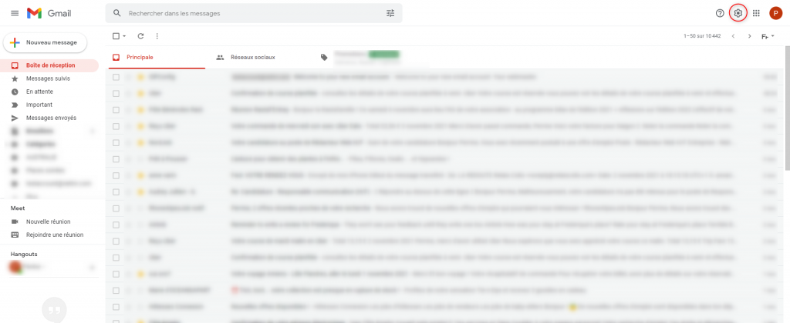

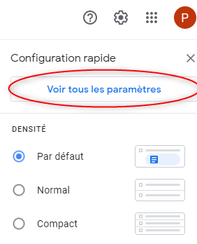

Allez dans l'onglet *Comptes et importation* dans la section *Consulter d'autres comptes de messagerie*

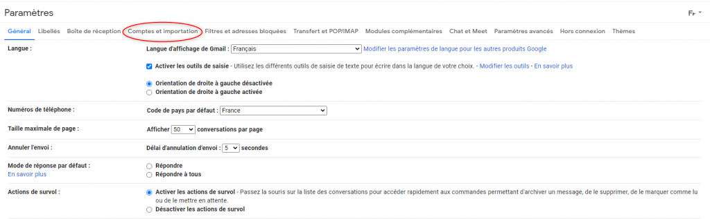

Cliquez sur *Ajouter un compte de messagerie*

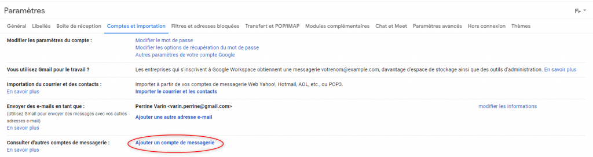

Entrez votre adresse mail de Télécom Nancy (Exemple : baptiste.jullien@telecomnancy.eu)

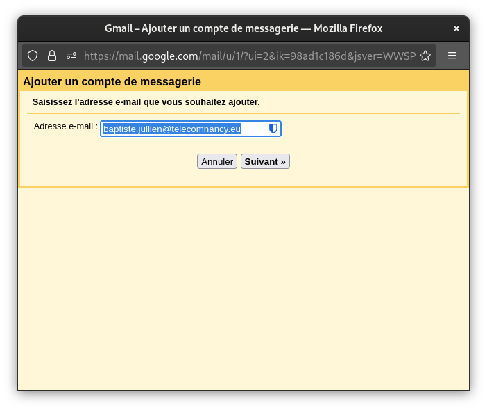

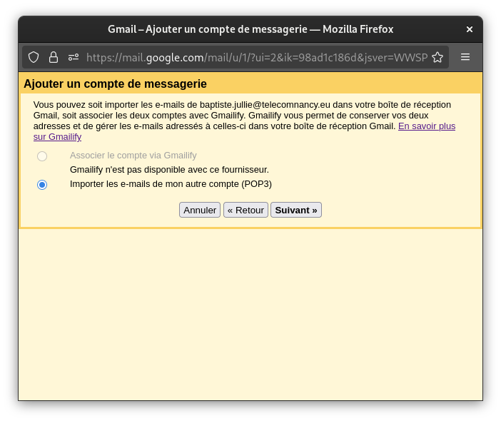

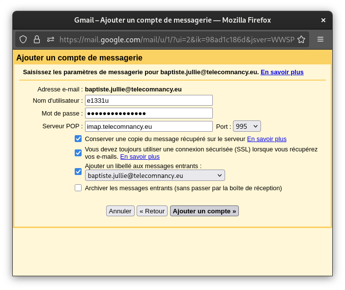

Pour envoyer des mails avec ta *@telecomnancy.eu*

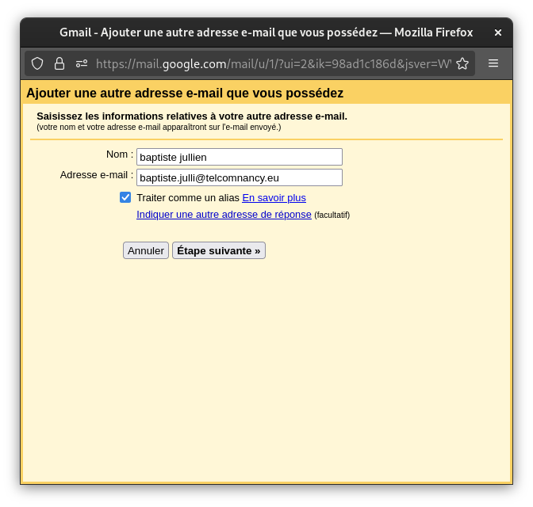

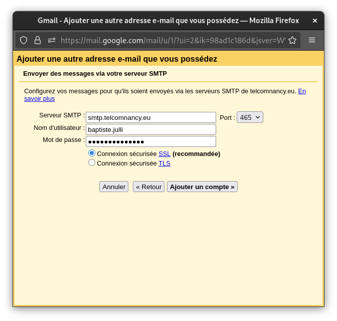

## Thunderbird

On clique sur la roue cranté en bas à droite
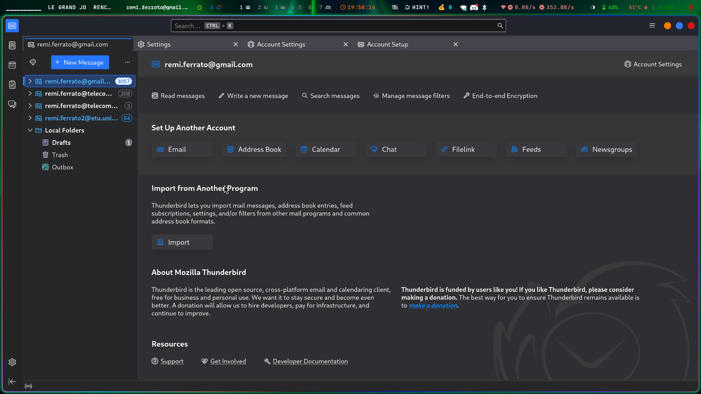
On va dans **account settings** puis **add mail account**
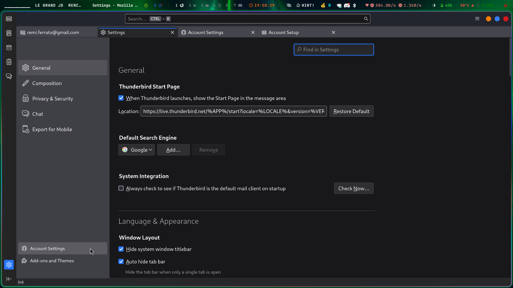
On remplie ses credentials (informations d'identification)
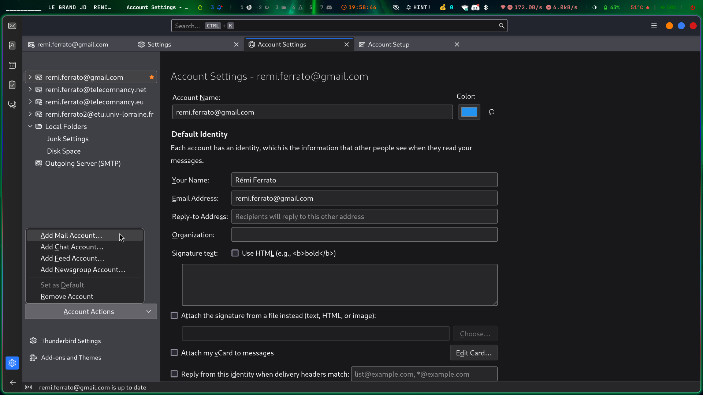
On clique sur **configure manualy**
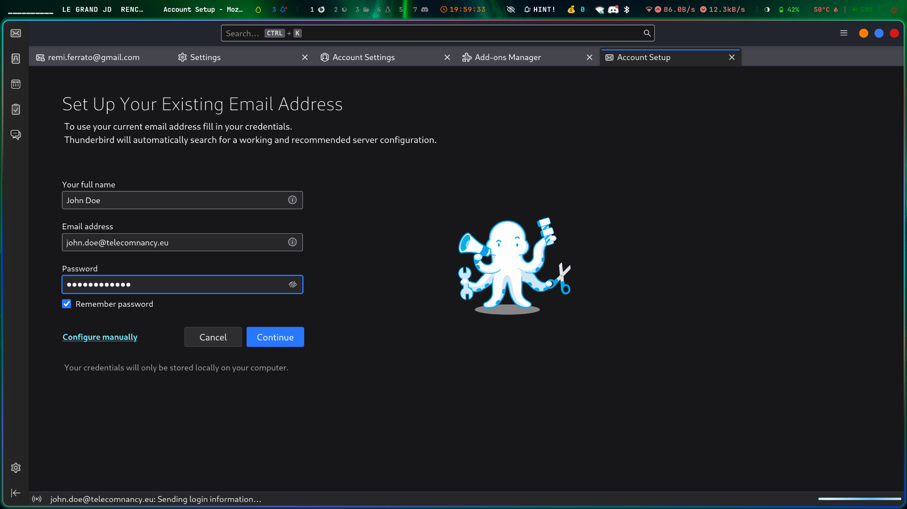
On remplie les paramètres
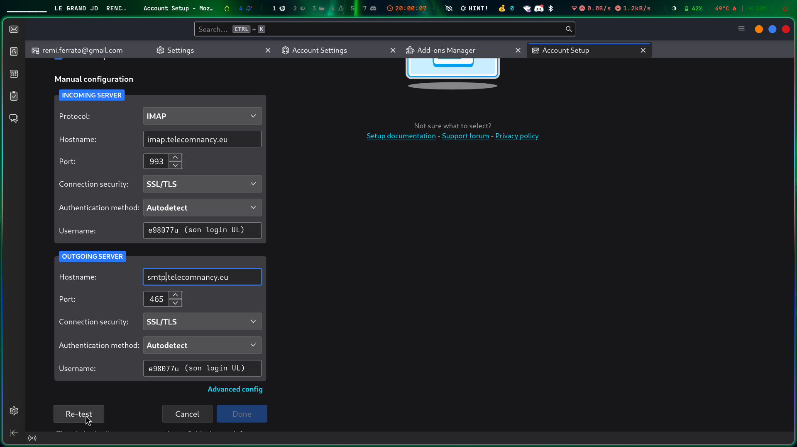
On appuie sur **test**, et si c'est bon, on clique sur **done**
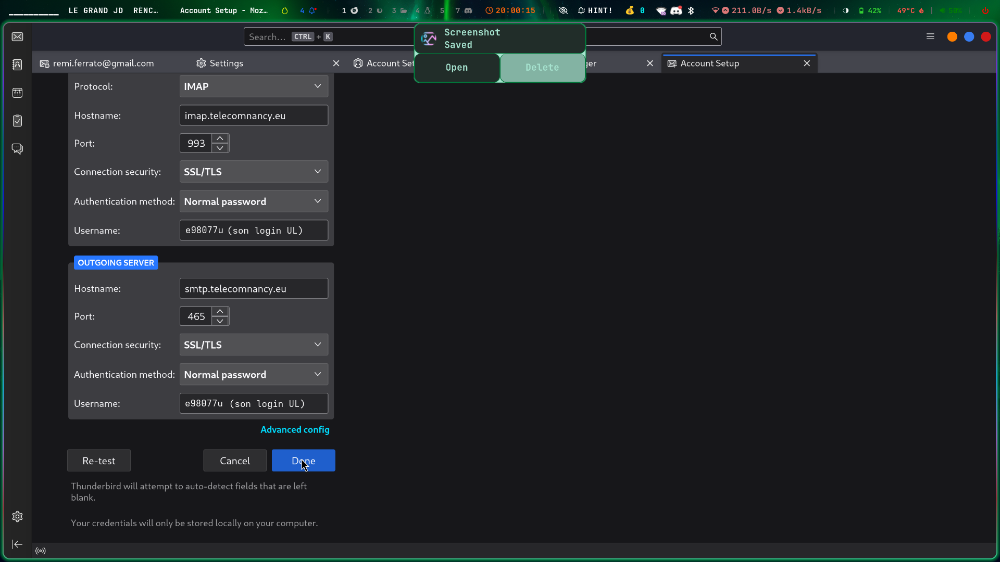

## Annexes

### Mail de L'UL

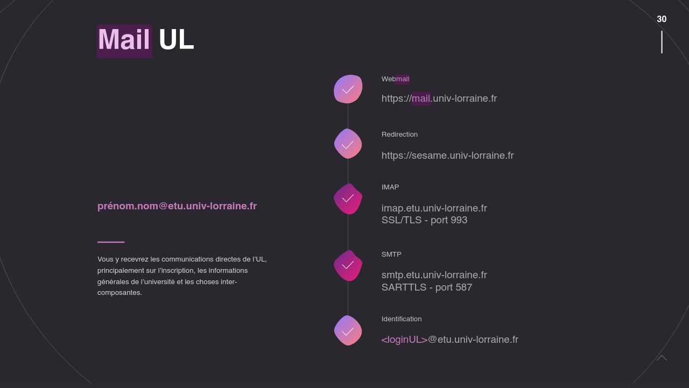

#### Interface Web

https://mail.univ-lorraine.fr/

#### Redirection

Mettez une redirection vers l'adresse mail de votre choix
https://sesame.univ-lorraine.fr/account/redirection

#### Connexion

Si vous avez besoin de vous connecter voici les informations

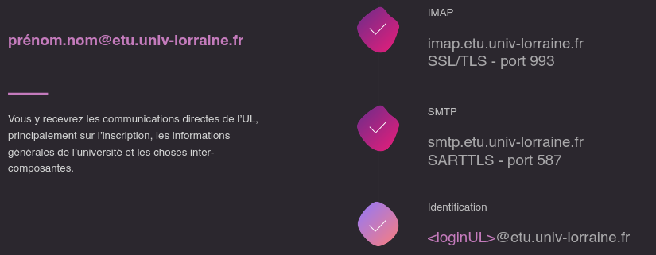

prenom.nom@etu.univ-lorraine.fr

##### IMAP
imap.etu.univ-lorraine.fr
SSL/TLS - port 993

##### SMTP
smtp.etu.univ-lorraine.fr
SARTTLS - port 587

##### Identification
"loginUL"@etu.univ-lorraine.fr

### Source 

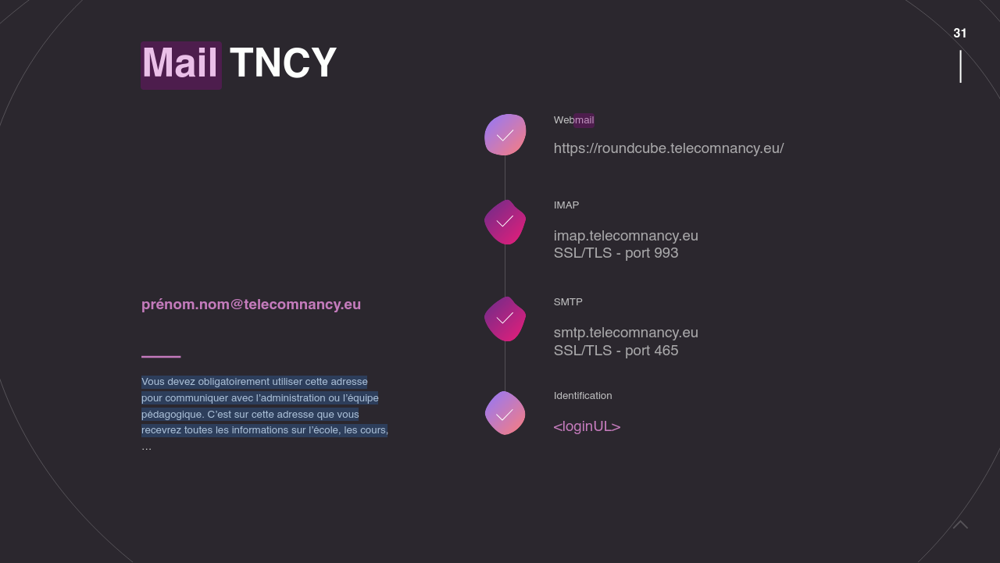
