# Comment contribuer ?

Si vous voyez une erreur ou si vous voulez remettre à jour ce guide :
[https://github.com/CETEN-BDE/TN-User-Guide](https://github.com/CETEN-BDE/TN-User-Guide)

Si vous ne savez pas comment contribuer à un projet open source :
[https://docs.github.com/fr/get-started/exploring-projects-on-github/contributing-to-a-project](https://docs.github.com/fr/get-started/exploring-projects-on-github/contributing-to-a-project)

# Tuto Eduroam

## Lien Utile

[Tuto de L'université de Lorraine](https://wiki.univ-lorraine.fr/bin/view/publique/dn/com/wifi/Configurateur%20WiFi/)

## OS Selection

[Linux](#linux)
[Macos](#macos)
[Windows](#windows)
[Android](#android)
[iOS](#ios)

## Eduroam Version PC

### Linux

- Pour connection il faut :
    - être connecté à internet avec autre chose (partage de connexion ou autre wifi ou connexion filaire par exemple)
    - Ne pas être connecté un VPN sinon risque de bannissement
- Ensuite aller sur la page à https://cat.eduroam.org/


Cliquer sur le gros bouton bleu


Cliquer ensuite sur Université de Lorraine 

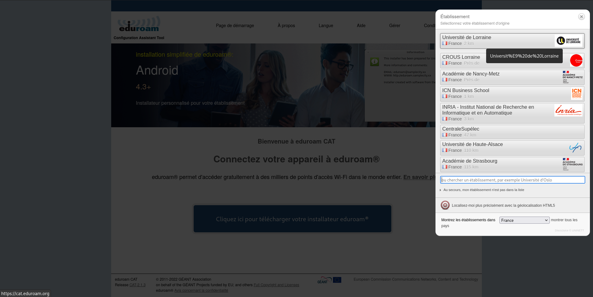


Cliquer ensuite sur Eduroam

Ceci devrait vous avoir télécharger un ficher "eduroam-linux-eduroam_et_Personnels_Univ-Lorraine.py"

Aller dans votre dossier de téléchargement et lancer le fichier avec python

Sur ubuntu:

Lancer un terminal avec la racourci CTRL + ALT + T

Sinon :

Touche Windows puis terminal puis Enter

Vous avez lancer un terminal


Vous pouvez maintenant executer cette commande


Version Français:

```bash
python3 ~/Téléchargements/eduroam-linux-eduroam_et_Personnels_Univ-Lorraine.py
```

Version Anglais:
```bash
python3 ~/Downloads/eduroam-linux-eduroam_et_Personnels_Univ-Lorraine.py
```


Une fois la commande lancer en appuyant sur Enter Vous arrivez sur cette fenetre:

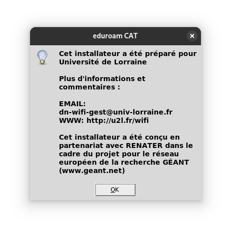

Cliquer sur **ok** puis sur **oui**


Dans entrer votre identifiant utilisateur : "loginul"@etu.univ-lorraine.fr par exemple e1331u@etu.univ-lorraine.fr
Dans entre le mot de passe : Votre Mot de passe de l'ul : Par exemple JaimeBeaucoupLesTresLongMotDePasseParceQueCEstSecurise ne mettez pas le même
Dans Entrez à Nouveau votre mot de passe : Votre Mot de passe de l'ul : Par exemple JaimeBeaucoupLesTresLongMotDePasseParceQueCEstSecurise ne mettez pas le même

Voilà vous pouvez maintenant vous connecté au wifi eduroam et la connexion devrait se faire tous seule.

Si vous n'arrivez pas à vous connecté cf [Problème Récurrents](#problème-récurrents)

### Macos


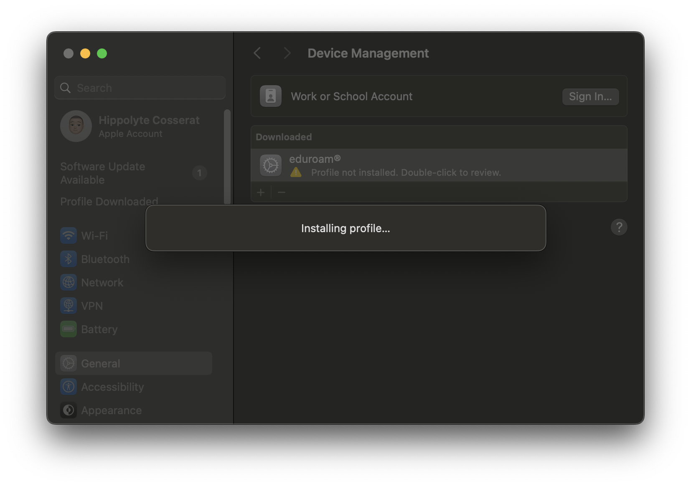


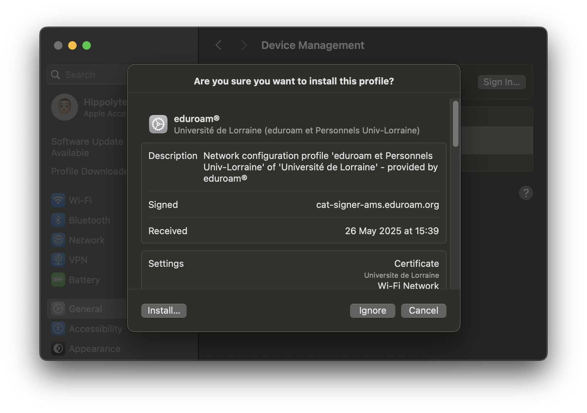


Si vous n'arrivez pas à vous connecté cf [Problème Récurrents](#problème-récurrents)

### Windows

Connecter vous à Eduroam:

Dans entrer votre identifiant utilisateur : "loginul"@etu.univ-lorraine.fr par exemple e1331u@etu.univ-lorraine.fr
Dans entre le mot de passe : Votre Mot de passe de l'ul : Par exemple JaimeBeaucoupLesTresLongMotDePasseParceQueCEstSecurise (ne mettez pas le même)

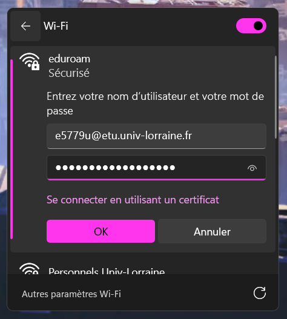

Voilà vous pouvez maintenant vous connecté au wifi eduroam et la connexion devrait se faire tous seule.

Si vous n'arrivez pas à vous connecté cf [Problème Récurrents](#problème-récurrents)

## Eduroam Version Tel

### Android

Pour pouvoir vous connecté à Eduroam avec votre tel il faut:
- Aller sur le Play Store et chercher "geteduroam"
- Téléchargé l'application
- Lancer l'application et chercher "lorraine"


- Cliquer sur Université de Lorraine
- Dans identifiant entrer "loginul"@etu.univ-lorraine.fr ; Par exemple e1331u@etu.univ-lorraine.fr
- Dans Mot de passe entrer Votre Mot de passe de l'ul ; Par exemple JaimeBeaucoupLesTresLongMotDePasseParceQueCEstSecurise (ne mettez pas le même)


- Vous pouvez maintenant ajouter le réseau et vous connecté à Eduroam sur votre téléphone


Si vous n'arrivez pas à vous connecté cf [Problème Récurrents](#problème-récurrents)

### iOS


- Cliquer sur Eduroam
- Dans identifiant entrer "loginul"@etu.univ-lorraine.fr ; Par exemple e1331u@etu.univ-lorraine.fr
- Dans Mot de passe entrer Votre Mot de passe de l'ul ; Par exemple JaimeBeaucoupLesTresLongMotDePasseParceQueCEstSecurise (ne mettez pas le même)


- Puis cliquer sur Se Fier


- Vous êtes maintenant connecté à eduroam

Si vous n'arrivez pas à vous connecté cf [Problème Récurrents](#problème-récurrents)

### Configuration Manuel

Si vous avez besoin de configurer la connexion eduroam à la main. Voici un exemple de configuration


Le certificat dans le screenshot appelé ca.pem est disponible dans l'installateur python de eduroam à la fin du fichier


Certificat Actuelle mais qui ne marchera surement plus dans 1 an

https://wiki.univ-lorraine.fr/bin/download/publique/dn/com/wifi/Archives%20-%20M%C3%A9thodes%20obsol%C3%A8tes/PersUL%20-%20Linux%20Ubuntu/WebHome/ca-ul.pem?rev=1.2

```
-----BEGIN CERTIFICATE-----
MIIGUjCCBDqgAwIBAgIJAOcn8wmq9LipMA0GCSqGSIb3DQEBCwUAMIG1MQswCQYD
VQQGEwJGUjEPMA0GA1UECAwGRnJhbmNlMQ4wDAYDVQQHDAVOYW5jeTEfMB0GA1UE
CgwWVW5pdmVyc2l0ZSBkZSBMb3JyYWluZTELMAkGA1UECwwCRE4xHzAdBgNVBAMM
FlVuaXZlcnNpdGUgZGUgTG9ycmFpbmUxNjA0BgkqhkiG9w0BCQEWJ2RuLWNlcnRp
ZmljYXRzLWNvbnRhY3RAdW5pdi1sb3JyYWluZS5mcjAeFw0xNzAzMTQwNzU1MTZa
Fw0zNzAzMDkwNzU1MTZaMIG1MQswCQYDVQQGEwJGUjEPMA0GA1UECAwGRnJhbmNl
MQ4wDAYDVQQHDAVOYW5jeTEfMB0GA1UECgwWVW5pdmVyc2l0ZSBkZSBMb3JyYWlu
ZTELMAkGA1UECwwCRE4xHzAdBgNVBAMMFlVuaXZlcnNpdGUgZGUgTG9ycmFpbmUx
NjA0BgkqhkiG9w0BCQEWJ2RuLWNlcnRpZmljYXRzLWNvbnRhY3RAdW5pdi1sb3Jy
YWluZS5mcjCCAiIwDQYJKoZIhvcNAQEBBQADggIPADCCAgoCggIBALj4jO1JypW+
Q64JILzZJLSeJKiND/XN4EFnAuQC3nRztJn68tEFkjKJT7T9sD7HZDrV8RRPbLIc
DSsZYGLnUFqz5M2kI6Cq0kWq7t20/pRrLZktE2OMztgSV7O2x12RBYxzsWFysuWx
ivETSbQpl938A9EefUyH6wiuUhjIDyyGmPcWiFZpz3qxMHxJLPqOUFpcrMkvLtnG
7RFIB77bvsSA8CRppIkZX9fBd/XU9Yy4nMGoOzkoyYOuXnptsmTi4JClByph6wtN
5zYAKQ8u8jG07D3pWqP+yTEOJ3r36xBUe2C8SiLE3Uwm+1HQ+sWCe5DuQ6p278zP
8QDZiI1REw07kXhqmdrKD+TsXH7Nc809AulAPpyiuIK4GU1g392es7JeLJnUC2Qt
GS++nTIH0fESwaN+BbPHlg3x2S/kV+O2c2mnKle5pENS+U23/M9m3Yj5OMNvJ8El
l70uh0OdoXt4glXot5PoV5CA9Zqz1BoBSte4Je7PNQ3s3M5+Sb6XmVzDFDgTj5hH
i2Vj30xvyVt3wa2BKaqwAuBBDhol8Z4A3hcd/03HnueG8Q7f5qD2RNIspOgdwj9j
Va9IOJ9imvl3dNn47DyKEEiXUz1gBcy0qNJLCXH/UmZQWA1ceX7SKmV+C1lCAYqT
m8GXkferL8g4SSq08SuHG82EC4cLqQLlAgMBAAGjYzBhMB0GA1UdDgQWBBTW3EjG
MzB7l0wyU3U6td1p37X8CDAfBgNVHSMEGDAWgBTW3EjGMzB7l0wyU3U6td1p37X8
CDAPBgNVHRMBAf8EBTADAQH/MA4GA1UdDwEB/wQEAwIBhjANBgkqhkiG9w0BAQsF
AAOCAgEASP7f9K2BrP4JGbqckSJCWVT+ZT6z79mSHAo/5ZZ/cSbNYd8jUljOu0Jl
zRA9wBNXW+dtG31Hvzb74WiT1XRt5QaU7+slNcEvRuQWVmPok3qnVpfS7VXOLzVd
SRXuQvZw08EEDkj+4XMiqSoplY1Tn47f9AVCE9GnodIeZAhp9s+xggrXhNiOwvDz
pgXlluZM3kyf+Fas2lIXKwbJu+3nAf3UZlNDd0qeGbQHkBquxMp9Cbq6BmsHr28q
lBPIM73RVjLPNw9g7vaNnLXZLgYX69uafYBFSu6srQFhwrRKr8J5yQVbnzWUss26
pTIZVX/7GMm3sX8w4KZhaiMmMP5QC/rtbIcA8QyjzY/aIYrZnMHsEvPmoxdXOh8C
QMB15zPMPN56mIMLkKvILbvZf+9f0vtb2n1CTQPr315UC7smUWZDEzJQO381ElgN
dgH7l3mjN4tyu/X02hGkxjmjevt6ZBBxshKa9o35oIHDzgE2+1F8A8YrYE2gT0uJ
6OVexj5cuP5g5qqLQync2YeIIDLLgYac4/d56AFFMNM7gdjr8hYNseWQnlz8Z2oh
+dBQEJOq7WilBpPQtxJlrI4TKYARwZ3gf7IS3rD+iStme9jF5rVf6V3lhldFeFS3
pr1Ggfl8g2jpe4+9LYeO4coBq54z+HKxsXDdqZMC5+l+7ID1AgA=
-----END CERTIFICATE-----
```

Si vous n'arrivez pas à vous connecté cf [Problème Récurrents](#problème-récurrents)

#### Lien utile

https://wiki.univ-lorraine.fr/bin/view/publique/dn/com/wifi/Archives%20-%20M%C3%A9thodes%20obsol%C3%A8tes/PersUL%20-%20Linux%20Ubuntu/?srid=u5H5omph#HImportationdel27autoritE9decertification

### Problème Récurrents

Si ça ne marche pas refaite l'opération mais en ***vérifiant très bien votre mot de passe*** J'ai déjà eu quelqu'un qui était persuader d'avoir mis le bon mot de passe.
Vous pouvez copié votre mot de passe mis pour vous connecté à Arche
Ou vous Pouvez utilisé un Password Manager comme BitWarden ou ProtonPass (Team Bitwarden)

ça marche toujours pas:

Vérifié que vous avez bien mis 2 'r' à lorraine. ça m'est déja arrivé 

Si vous êtes sûr d'avoir correctement fait de ces étapes mais vous n'avez toujours pas vous connecté vous êtes potentiellement bannie de L'université de Lorraine. Pas de panique, L'univ ban toute utilisation de VPN donc si vous avez utilisé un VPN comme NordVPN ou autre il faut aller vous Monsieur Bouthier étage 1 côté Aile nord pour vous demander de vous debannir.
# Mail

## Mail Selection

[Gmail](#gmail)
[Thunderbird](#thunderbird)

### Interface Web

https://roundcube.telecomnancy.eu/
https://webmail.telecomnancy.eu/SOGo/so/

LoginUL
MotDePasseDeL'UL

### Connecter sa .eu à Gmail ou Thunderbird

#### Gmail

Aller dans les paramètres de gmail

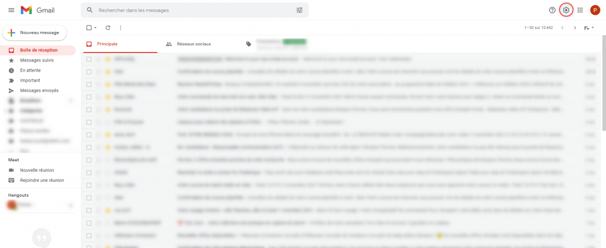


Aller dans l'onglet *Comptes et importation* dans la section *Consulter d'autres comptes de messagerie*


Cliquer sur *Ajouter un compte de messagerie*


Entrer votre adresse mail de Télécom Nancy (Exemple : baptiste.jullien@telecomnancy.eu)

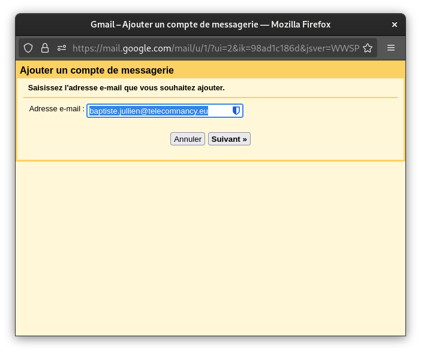

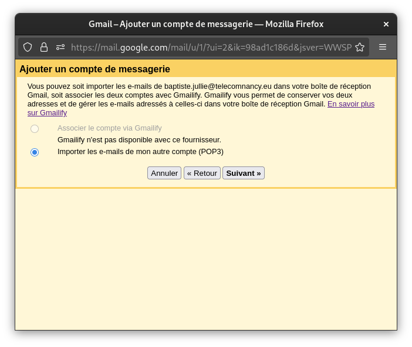


Pour envoyé des mail avec ta *@telecomnancy.eu*


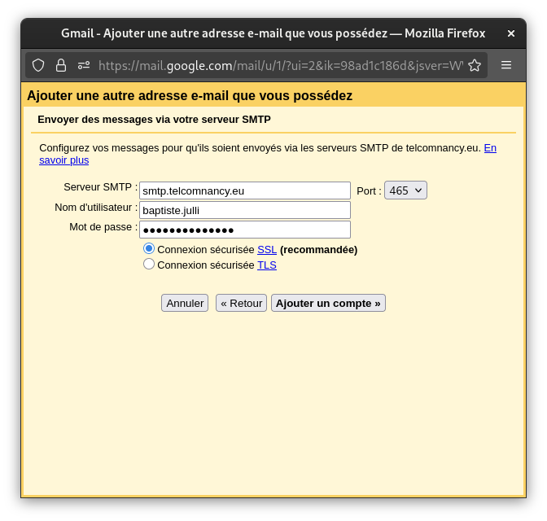

#### Thunderbird

On clique sur la roue cranté en bas à droite
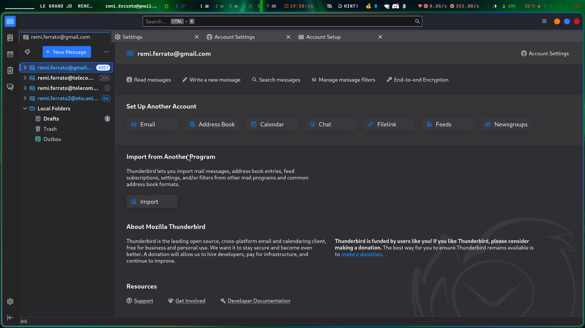
On va dans account settings puis add mail account

On remplie ces creds
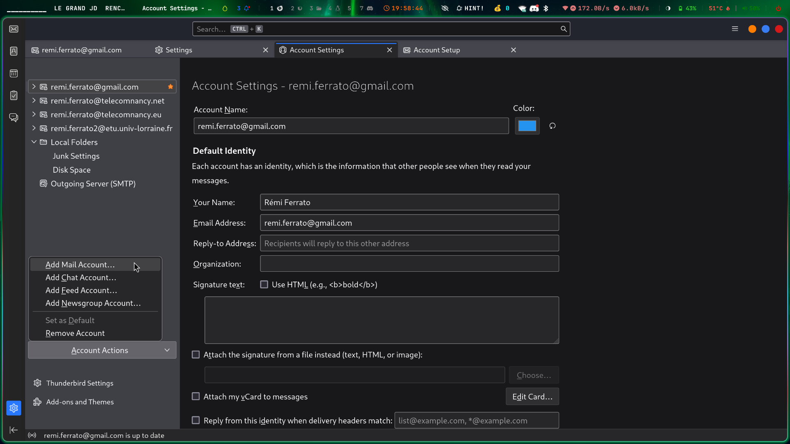
On clique sur configure manualy

On remplie les paramètres

On appuie sur test, et si c'est bon, on clique sur done
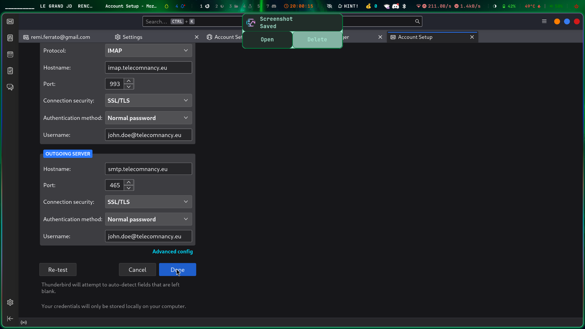

## Mail de L'UL


### Interface Web

https://mail.univ-lorraine.fr/

### Redirection

Mettez un redirection vers l'adresse mail de votre choix
https://sesame.univ-lorraine.fr/account/redirection

### Connexion

Si vous avez besoin de vous connecter voici les informations


prénom.nom@etu.univ-lorraine.fr

#### IMAP
imap.etu.univ-lorraine.fr
SSL/TLS - port 993

#### SMTP
smtp.etu.univ-lorraine.fr
SARTTLS - port 587

#### Identification
"loginUL"@etu.univ-lorraine.fr

## Source 


# VPN

## OS Selection

[Linux](#vpn-linux)
[Macos](#vpn-macos)
[Windows](#vpn-windows)

## VPN Macos

https://wiki.univ-lorraine.fr/bin/view/publique/dn/com/VPN/Configurations/Configuration%20VPN%20MAC/

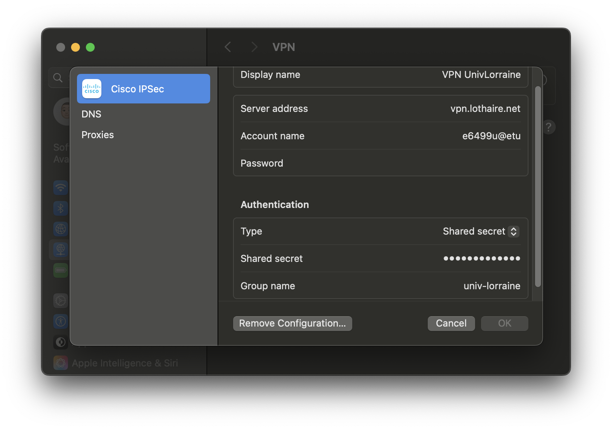

## VPN Windows

https://wiki.univ-lorraine.fr/bin/view/publique/dn/com/VPN/Configurations/Configuration%20VPN%20Windows%20-%20AnyConnect/

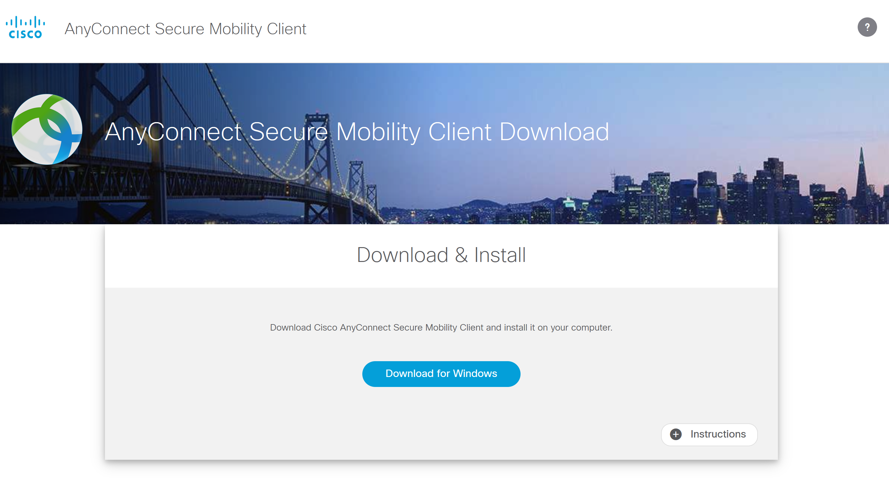
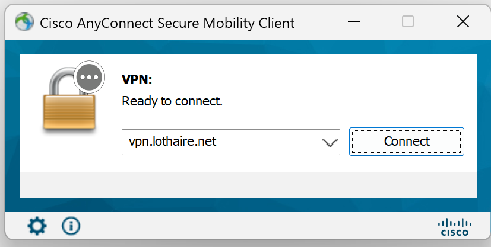
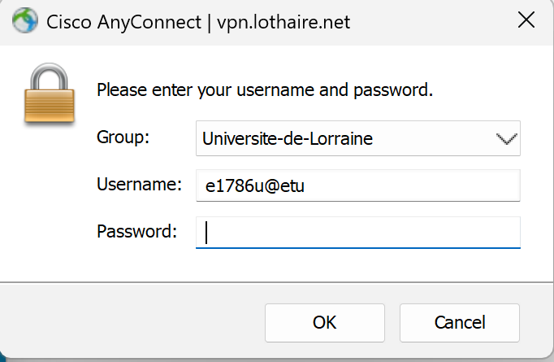
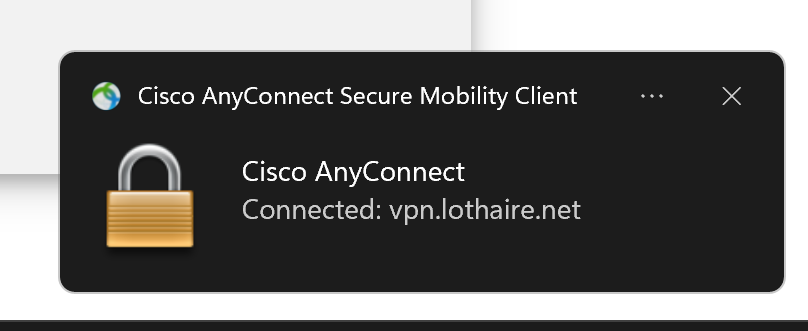

## VPN Linux

### Gnome Interface Graphique


#### Debian / Ubuntu / Linux Mint
```bash
sudo apt install network-manager-openconnect-gnome
```

#### Fedora

```bash
sudo dnf install NetworkManager-openconnect-gnome
```

#### RHEL / CentOS / AlmaLinux / Rocky Linux

```bash
sudo dnf install epel-release
sudo dnf install NetworkManager-openconnect-gnome
```

#### Arch Linux / Manjaro
```bash
sudo pacman -S networkmanager-openconnect
```

#### openSUSE
```bash
sudo zypper install NetworkManager-openconnect-gnome
```

#### NixOS
```nix
# (au-dessus) Autres paquets système
environment.systemPackages = with pkgs; [
    # Ce qu'on veut ajouter
    networkmanager-openconnect
    # (en-dessous) D'autres paquets éventuels
];
```

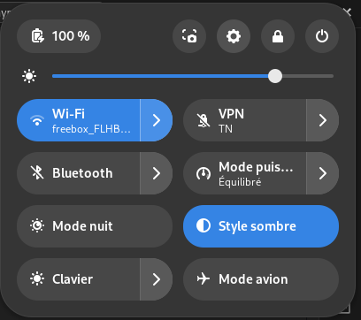

Cliquer sur `Multi-protocol VPN cliet (openconnect)`

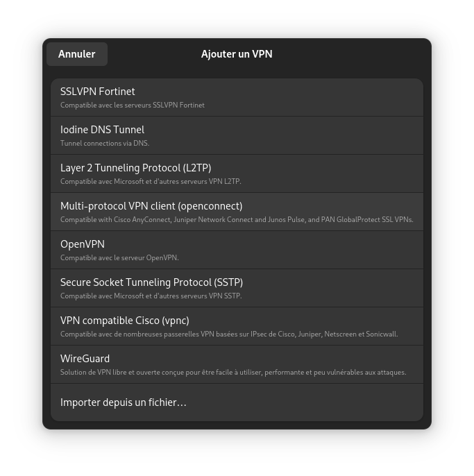


Cliquer sur `Connect`


Mettez votre `loginUL@etu` et votre MDP de l'UL et Cliquer sur `Login`


### Ligne de commande

Les packets necessaire

```
openconnect
```

##### Debian / Ubuntu / Linux Mint

```bash
sudo apt install openconnect
```

##### Fedora
```bash
sudo dnf install openconnect
```

##### RHEL / CentOS / AlmaLinux / Rocky Linux
```bash
sudo dnf install openconnect
```

##### Arch Linux / Manjaro
```bash
sudo pacman -S openconnect
```

##### openSUSE
```bash
sudo zypper install openconnect
```

##### NixOS
```nix
{
  environment.systemPackages = with pkgs; [
    openconnect
  ];
}
```

Remplacer e1331u par votre loginUL puis taper votre mots de passe de l'UL

```bash
sudo cat VPNTN.conf | sudo openconnect -u e1331u@etu --authgroup="Universite-de-Lorraine" vpn.univ-lorraine.fr --passwd-on-stdin
```


Si vous voulez evité de devoir le taper à chaque fois

Crée un fichier VPNTN.conf puis mettez votre mots de passe dedans 

/!\ Attention /!\ Ceci est potentiellement dangereux si votre disque n'est pas chiffré puisque on peut lire votre disque depuis un clé bootable par exemple. A vous de voir si vous avez peur des attaque physique bien que très improbable (vol ordinateur, etc ...).
Penser bien au permission d'accès à ce fichier doivent être administrateur

Voici les commandes pour le faire
```bash
echo "VotreMotDePasseDeL'Univ" > VPNTN.conf
chown root:root VPNTN.conf
chmod 600 VPNTN.conf
```

```bash
sudo cat VPNTN.conf | sudo openconnect -u e1331u@etu --authgroup="Universite-de-Lorraine" vpn.univ-lorraine.fr --passwd-on-stdin
```

Remplacer e1331u par votre loginUL puis taper votre mots de passe de l'UL
