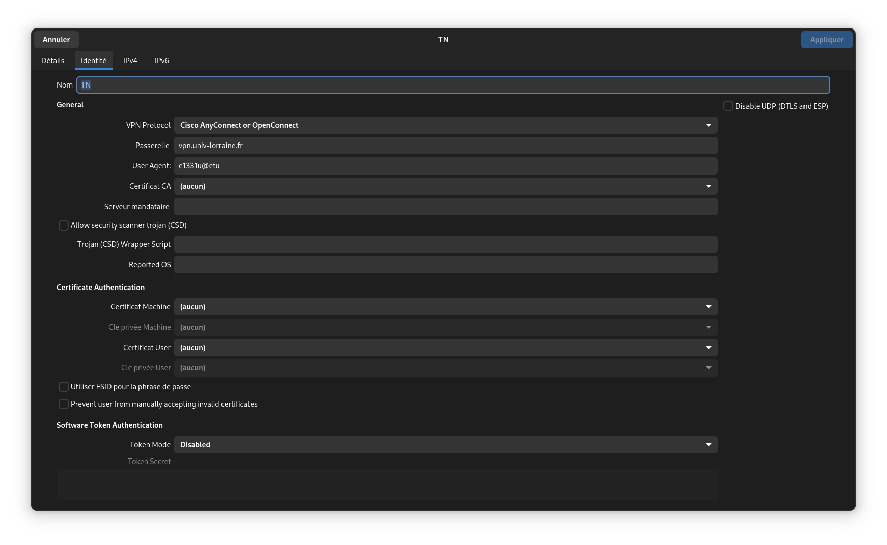
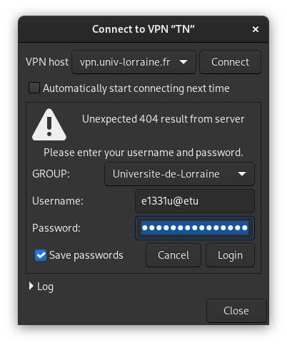

# VPN

## OS Selection

[Linux](#vpn-linux)
[Macos](#vpn-macos)
[Windows](#vpn-windows)

## VPN Macos

https://wiki.univ-lorraine.fr/bin/view/publique/dn/com/VPN/Configurations/Configuration%20VPN%20MAC/


## VPN Windows

https://wiki.univ-lorraine.fr/bin/view/publique/dn/com/VPN/Configurations/Configuration%20VPN%20Windows%20-%20AnyConnect/


## VPN Linux

### Gnome Interface Graphique


#### Debian / Ubuntu / Linux Mint
```bash
sudo apt install network-manager-openconnect-gnome
```

#### Fedora

```bash
sudo dnf install NetworkManager-openconnect-gnome
```

#### RHEL / CentOS / AlmaLinux / Rocky Linux

```bash
sudo dnf install epel-release
sudo dnf install NetworkManager-openconnect-gnome
```

#### Arch Linux / Manjaro
```bash
sudo pacman -S networkmanager-openconnect
```

#### openSUSE
```bash
sudo zypper install NetworkManager-openconnect-gnome
```

#### NixOS
```nix
# (au-dessus) Autres paquets système
environment.systemPackages = with pkgs; [
    # Ce qu'on veut ajouter
    networkmanager-openconnect
    # (en-dessous) D'autres paquets éventuels
];
```


Cliquer sur `Multi-protocol VPN cliet (openconnect)`




Cliquer sur `Connect`


Mettez votre `loginUL@etu` et votre MDP de l'UL et Cliquer sur `Login`



### Ligne de commande

Les paquets nécessaires

```
openconnect
```

##### Debian / Ubuntu / Linux Mint

```bash
sudo apt install openconnect
```

##### Fedora
```bash
sudo dnf install openconnect
```

##### RHEL / CentOS / AlmaLinux / Rocky Linux
```bash
sudo dnf install openconnect
```

##### Arch Linux / Manjaro
```bash
sudo pacman -S openconnect
```

##### openSUSE
```bash
sudo zypper install openconnect
```

##### NixOS
```nix
{
  environment.systemPackages = with pkgs; [
    openconnect
  ];
}
```

Remplacez e1331u par votre loginUL puis tapez votre mots de passe de l'UL

```bash
sudo cat VPNTN.conf | sudo openconnect -u e1331u@etu --authgroup="Universite-de-Lorraine" vpn.univ-lorraine.fr --passwd-on-stdin
```


Si vous voulez éviter de devoir le taper à chaque fois

Crée un fichier VPNTN.conf puis mettez votre mots de passe dedans 

/!\ Attention /!\ Ceci est potentiellement dangereux si votre disque n'est pas chiffré puisque on peut lire votre disque depuis un clé bootable par exemple. A vous de voir si vous avez peur des attaque physique bien que très improbable (vol ordinateur, etc ...).
Pensez bien aux permissions d'accès à ce fichier qui  doivent être administrateur

Voici les commandes pour le faire
```bash
echo "VotreMotDePasseDeL'Univ" > VPNTN.conf
chown root:root VPNTN.conf
chmod 600 VPNTN.conf
```

```bash
sudo cat VPNTN.conf | sudo openconnect -u e1331u@etu --authgroup="Universite-de-Lorraine" vpn.univ-lorraine.fr --passwd-on-stdin
```

Remplacez e1331u par votre loginUL puis tapez votre mot de passe de l'UL
